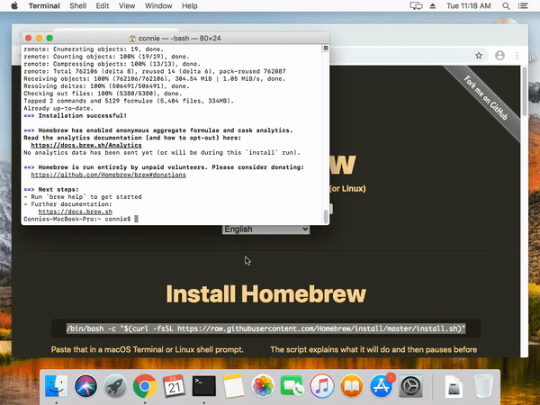
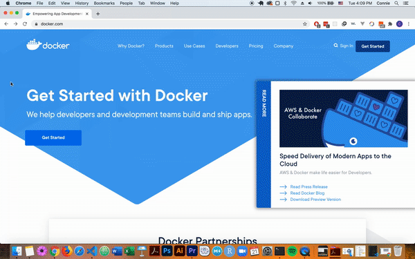

# Quickstart

## Skip to section

* [Installing Pushkin and dependencies](quickstart.md#installing-pushkin-and-dependencies)
* [Creating a basic new Pushkin site](quickstart.md#creating-basic-new-pushkin-site)
* [Making an experiment](quickstart.md#making-an-experiment)
* [Setting up logins](quickstart.md#setting-up-logins)
* [Local testing](quickstart.md#local-testing)
* [Updating](quickstart.md#updating)
* [Starting over](quickstart.md#starting-over)

### Installing Pushkin and dependencies

#### macOS

1.\) If you don’t have [Homebrew](https://brew.sh/), install it. If you do not have Xcode installed yet, this installation will prompt you to install it as well.


2.\) Then run the following to get yarn, which will let you download Pushkin:

```bash
$ brew install yarn
```



3.\) Install the pushkin-cli package globally.

```bash
$ yarn global add pushkin-cli
```


4.\) Confirm that pushkin-cli is installed by running:

```bash
$ pushkin --help
```


You should get a list of commands with some documentation for each. We’ll be going through the critical ones below.

5. Next, install [Docker](https://docs.docker.com/install/).



#### Windows 10

We are eventually hoping to be able to use [the Windows Subsystem for Linux \(WSL\)](https://docs.microsoft.com/en-us/windows/wsl/) to deploy Pushkin on Windows. This setup is not currently working reliably, however, so we suggest that Windows users create a Ubuntu virtual machine and follow the Ubuntu instructions to try out and test Pushkin. When Microsoft releases a fix that solves the problem, we will update our documentation with Windows-specific instructions.

You can follow [this tutorial](https://www.freecodecamp.org/news/how-to-install-ubuntu-with-oracle-virtualbox/) to set up your Ubuntu virtual machine on Windows 10. We recommend using Ubuntu 18.04.

Once you have configured your virtual machine and installed Ubuntu, open the Ubuntu Terminal by pressing CTRL and typing 'terminal' and ENTER or by using the keyboard shortcut CTRL+ALT+T. Once you have opened the terminal, run the following commands to update your Ubuntu packages. This \(and other commands with `sudo` in front of them\) will prompt you to give the Ubuntu password you set up when you installed it. It will also prompt you to respond with `y` and press ENTER to confirm that you would like to install or update any software packages.

```bash
$ sudo apt update
$ sudo apt upgrade
```

\(For more on package management with apt, you can see the documentation [here](https://ubuntu.com/server/docs/package-management). To learn more about the basics of the Linux command line, you can follow [this tutorial](https://ubuntu.com/tutorials/command-line-for-beginners#1-overview).\)

From here, you can follow the instructions below for Ubuntu Linux to finish the installation.

#### Ubuntu Linux

These instructions were created using Ubuntu 18.04 and the apt package manager but should generalize to other Linux distributions and package managers.

First, ensure that you have curl installed, as this will be necessary to download Node. If it is not installed, it can be installed using the following commands:

```bash
$ sudo apt update
$ sudo apt install curl
```
 


To install the latest version of Node.js , follow [these instructions at NodeSource](https://github.com/nodesource/distributions/blob/master/README.md#installation-instructions). The instructions are copied below for convenience, but it is best to follow the link in case their instructions change in the future.

```bash
$ curl -sL https://deb.nodesource.com/setup_14.x | sudo -E bash -
$ sudo apt install -y nodejs
```


You will next want to install the Yarn package manager. Official instructions \(copied below for convenience\) are available [here](https://classic.yarnpkg.com/en/docs/install/#debian-stable).

```bash
$ curl -sS https://dl.yarnpkg.com/debian/pubkey.gpg | sudo apt-key add -
$ echo "deb https://dl.yarnpkg.com/debian/ stable main" | sudo tee /etc/apt/sources.list.d/yarn.list
$ sudo apt update && sudo apt install yarn
```


To allow Yarn to install pushkin-cli globally, run the following steps, based on [this StackExchange solution](https://stackoverflow.com/a/53879534).

Run the following:

```bash
$ yarn config set prefix ~/.yarn
$ echo 'export PATH="$PATH:`yarn global bin`"' >> ~/.bashrc
$ source ~/.bashrc
```


Next, install the pushkin-cli package globally.

```bash
$ yarn global add pushkin-cli
```


Confirm that pushkin-cli is installed by running:

```bash
$ pushkin --help
```


You should get a list of commands with some documentation for each. We'll be going through the critical ones below.

Next, install Docker Engine [using these instructions](https://docs.docker.com/engine/install/ubuntu/) \(copied below for convenience\).

```bash
$ sudo apt update
$ sudo apt install apt-transport-https ca-certificates curl gnupg-agent software-properties-common
$ curl -fsSL https://download.docker.com/linux/ubuntu/gpg | sudo apt-key add -
```


Verify the fingerprint of the key by running this command:

```bash
$ sudo apt-key fingerprint 0EBFCD88
```

Your output should look like this:

```bash
pub   rsa4096 2017-02-22 [SCEA]
      9DC8 5822 9FC7 DD38 854A  E2D8 8D81 803C 0EBF CD88
uid           [ unknown] Docker Release (CE deb) <docker@docker.com>
sub   rsa4096 2017-02-22 [S]
```


Next, add the repository and install Docker Engine.

```bash
$ sudo add-apt-repository "deb [arch=amd64] https://download.docker.com/linux/ubuntu $(lsb_release -cs) stable"
$ sudo apt update
$ sudo apt install docker-ce docker-ce-cli containerd.io
```


Check that Docker Engine has been installed correctly by running:

```bash
$ sudo docker run hello-world
```

If Docker Engine installed correctly, this should generate some output, including:

```bash
Hello from Docker!
This message shows that your installation appears to be working correctly.
```


Next, follow [these post-installation instructions](https://docs.docker.com/engine/install/linux-postinstall/#manage-docker-as-a-non-root-user) \(copied below for convenience\) to manage Docker as a non-root user. \(The rest of the post-installation instructions can be ignored.\)

```bash
$ sudo groupadd docker
$ sudo usermod -aG docker $USER
$ newgrp docker 
$ docker run hello-world
```


Finally, follow [these instructions](https://docs.docker.com/compose/install/#install-compose-on-linux-systems) \(copied below for convenience\) to install Docker Compose.

```bash
$ sudo curl -L "https://github.com/docker/compose/releases/download/1.26.2/docker-compose-$(uname -s)-$(uname -m)" -o /usr/local/bin/docker-compose
$ sudo chmod +x /usr/local/bin/docker-compose
$ docker-compose --version
```


### Creating a basic new Pushkin site

Make sure Docker is running by running the command `docker info`; if it is not, you can run `dockerd` or `sudo dockerd` to start it.

Then, if it is not open already, open a terminal window. Then you can create an empty directory called `pushkin_quickstart` \(although in principle it could have any name\) and move to this directory using the following commands:

```bash
$ mkdir pushkin_quickstart
$ cd pushkin_quickstart/
```

\(For more on basic terminal commands, you can check out [this blog post](https://medium.com/@grace.m.nolan/terminal-for-beginners-e492ba10902a).\)

You will be installing your first pushkin site the in the directory you just created.

```bash
$ pushkin install site
```

You will be asked to select a site template to use. Choose ‘default’.

This sets up a skeleton website in the current folder and sets up a development database. Once that finishes, you should have a directory tree that looks something like this:

```text
├── experiments
├── pushkin
   ├── api
   ├── docker-compose.dev.yml
   ├── front-end
   └── util
└── pushkin.yaml
```

Most of the stuff in the pushkin folder won’t need to be edited at all, with the exception of the website \(in the front-end folder\).

### Making an Experiment

To create a new experiment from the boilerplate template Pushkin provides, run

```bash
$ pushkin install experiment
```

Choose a ‘basic’ experiment. When prompted, name your experiment ‘vocab’. Repeat the process to add ‘basic’ experiments called ‘mind’ and ‘whichenglish’ as well.

This will create a new folder in the experiments directory like this:

```text
└── vocab
    ├── api controllers
    ├── config.yaml
    ├── migrations
    ├── seeds
    ├── web page
    └── worker
└── mind
    ├── api controllers
    ├── config.yaml
    ├── migrations
    ├── seeds
    ├── web page
    └── worker
└── whichenglish
    ├── api controllers
    ├── config.yaml
    ├── migrations
    ├── seeds
    ├── web page
    └── worker
```

Each experiment has its own folder containing files specific to that experiment. Within this folder, each experiment also has a configuration file \(`config.yaml`\) that allows you to define a human-readable full name for the experiment \(e.g., _Which English?_ for `whichenglish`\), specify a database to use, and make other customizations.

Keeping all the files for an experiment within the same root folder is convenient for development, but not for actually deploying the website. To redistribute the experiment files to the right places, run:

```bash
$ pushkin prep
```

### Setting up logins

In `config.js`, located at ./pushkin/front-end/src, set `useAuth` to `true` or `false` depending on whether you want to have a login system or not. Note that you cannot use a forum without a login system:

```javascript
useForum: false,
useAuth: false,
```

By default, Pushkin authenticates users using [Auth0](http://auth0.com/). This provides many features and better security than could be managed otherwise. It is free for open source projects \(contact [sales@auth0.com](mailto:sales%40auth0.com)\); otherwise it can be fairly pricey if you are hoping for a lot of users. To set up Auth0, use the following directions. \(Note that at some point, Auth0 will change up their website and these instructions may get out of date.\)

1. Go to auth0.com and create an Auth0 account.
2. Go to the _Applications_ section of the Auth0 dashboard and click _Create Application_.
3. Give your application and a name. Select _Single Page Web App_ as your application type. Click _Create_.
4. Choose the _Settings_ tab. In _Allowed Callback URLs_, add `http://localhost/`. In _Allowed Logout URLs_, add `http://localhost`. In _Allowed Web Origins_, also add `http://localhost`. Click the _Save Changes_ button.

Note that these URLs are used for development. When you launch the live version of your website, you will need to add your public URLs. Repeat the instructions above, replacing [http://localhost](http://localhost) with [https://YOUR-WEBSITE](https://YOUR-WEBSITE). For instance, for gameswithwords, the urls are `https://gameswithwords.org` and `https://gameswithwords/callback`.

On the settings page, you will see a `Domain` \(something like `gameswithwords.auth0.com`\) and a `Client ID`. Edit `config.js` to match:

```javascript
authDomain: '<YOUR_AUTH0_DOMAIN>',
authClientID: '<YOUR_AUTH0_CLIENT_ID>',
```

Finally, run `pushkin prep` again since you have made a change to your code.

### Local testing

Now, let’s look at your website! Make sure Docker is running by running the command `docker info`; if it is not, you can run `dockerd` or `sudo dockerd` to start it. Next, run:

```bash
$ pushkin start;
```

Now browse to `http://localhost` to see the stub website.

When you are done looking at your website, stop it by running:

```bash
$ pushkin stop;
```

If you don’t do that, the web server will keep running in Docker until you quit Docker or restart.

### Updating

Every time you update code or add an experiment, you’ll need to run pushkin prep again:

```bash
$ docker-compose -f pushkin/docker-compose.dev.yml start test_db
$ pushkin start
```

### Starting over

The great thing about Docker is that it saves your work. \(Read up on Docker to see what I mean.\) The bad thing is that it saves your work. Simply editing your code locally may not change what Docker thinks the code is. So if you are updating something but it’s not showing up in your website or if you are getting error messages from Docker … ideally, you should read up on Docker. However, as a fail-safe, run pushkin kill to delete all your pushkin-specific code in Docker. Then just run pushkin prep again. This will take a while, but should address any Docker-specific problems. If you really need a fresh Docker install, run pushkin armageddon, which will completely clean Docker.

